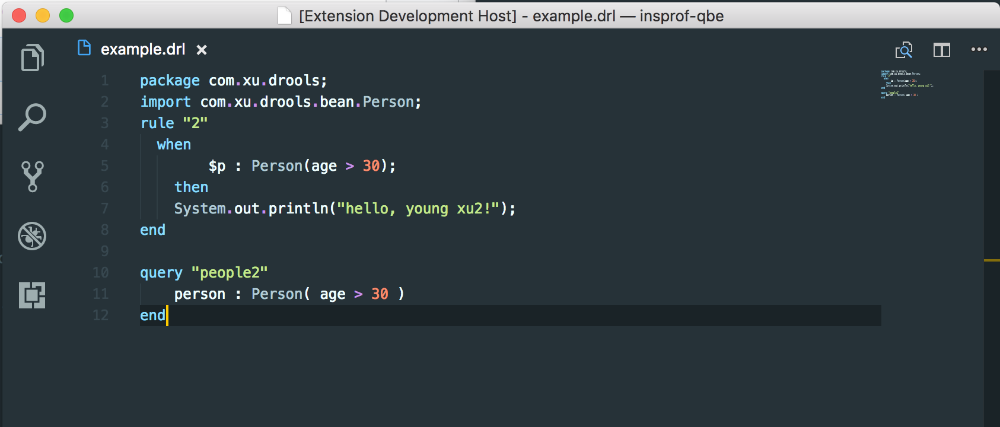

# Drools VS Code Extension

This extensions adds drools language support to VSC (.drl).

## Features

See image for example .drl syntax highlighting

## Contributors

Special thanks to https://github.com/mboyajia/drools-syntax-highlighter for the .tmLanguage file.
## Release Notes

### 0.0.1

Initial Release, enjoy!